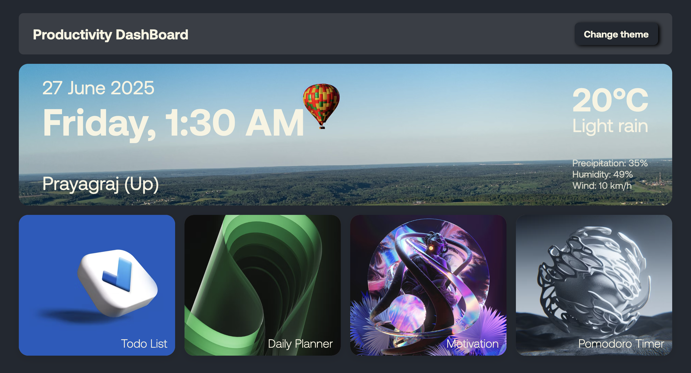

# 🧠 Productivity Dashboard 
### `Desktop view only`
---
#### Live Link : https://productivitydasboard.onrender.com/
---

A comprehensive and visually appealing **Productivity Dashboard** that helps you manage your tasks, schedule your day, stay motivated, and focus with a Pomodoro timer — all in one place.



---

## 🌟 Features

### ✅ Todo List
- Add tasks with optional descriptions.
- Mark tasks as completed.
- Delete tasks with confirmation.
- Data persists via `localStorage`.

### 📅 Daily Planner
- Schedule your day from **6:00 AM to 11:00 PM**.
- Inline edit your hourly slots.
- Instant delete with confirmation.
- Data saved using `localStorage`.

### 💬 Motivation Quotes
- Fetches a random motivational quote every time the app loads.
- Quote and author shown beautifully.

> **Quote API**: [Quotable API](https://api.quotable.io/random)

### ⏲️ Pomodoro Timer
- 25-minute work session followed by 5-minute break.
- Includes Start, Pause, and Reset controls.
- Session context and colors update dynamically.

### 🌦️ Live Weather & Time Display
- Real-time clock with day and date.
- Default city: **Allahabad**
- Weather info currently static, but easily replaceable with API.

> **Weather API Placeholder**: UI ready for [OpenWeatherMap](https://openweathermap.org)

### 🎨 Theme Switcher
- Cycle between 3 elegant color themes.
- Toggle via “Change Theme” button in the navbar.

---

## 🛠️ Tech Stack

- **HTML5**
- **CSS3**
- **JavaScript (Vanilla)**

---

## 📁 Directory Structure

```bash
productivity-dashboard/
│
├── Aeonik/                   # Custom font files (Aeonik)
│
├── assets/
│   ├── favicon.ico           # Favicon
│   ├── sc.png                # App UI screenshot
│   └── icons8-quote-100.png  # Icon used in the motivation section
│
├── index.html                # Main HTML structure
├── style.css                 # All app styling and theming
├── script.js                 # Core logic (JS functionality)
└── README.md                 # Project documentation

